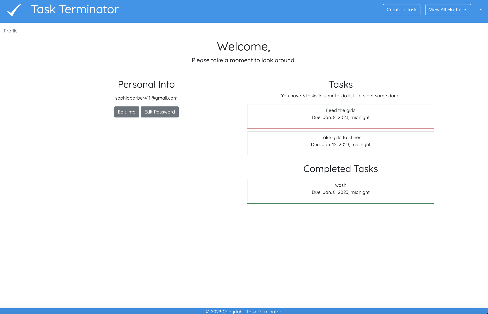
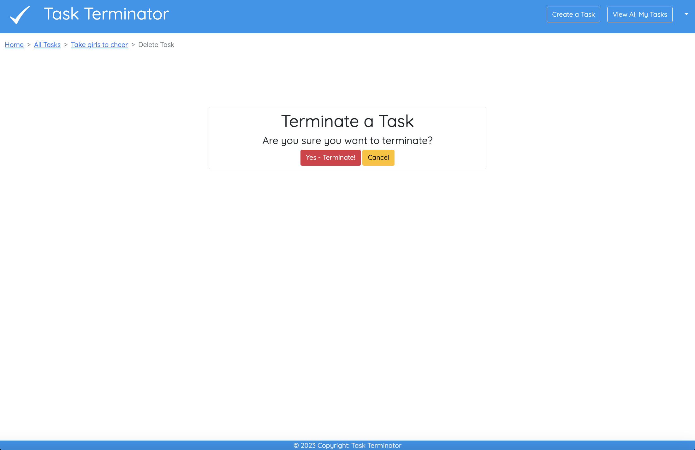

# Task Terminator
Created by: Matthew Atkins, Sophia Barber and Anthony Siletti
- - -
"Launch Task Terminator here"

- - -
## Task Terminator Overview:
- - -
Task Terminator is task management application used to manage all of your day-to-day tasks to aide in overall organization. Users will be able to create, edit and terminate all tasks once completed. 

Modern task reminder apps or websites consistently send notifications to your phone. Many users ignore their notifications due to the high volume of alerts and they tend to forget to terminate their tasks. As a result, many tasks are not completed and terminated throughout the day. 

Task Terminator will aide in terminating all tasks created because there will be a direct line of communication and notification to the users phone using a text message and/or email notification. 

If a task needs to be completed the card will be outlined in red until it is ultimately completed. If a task is completed, the card will be outlined in green with a badge stating "Task Complete" at the top right of the task card until it is ultimately terminated. Users will be able to priortize the level of urgency using the numbers 1-3 (1 low urgency and 3 high urgency). A badge will state the level of prioritization at the top right of each task that needs to be completed. 

## How To Use/Wireframe (Images Attached):
- - -
1. Homepage/Landing Page:
   
   When the user reaches the applications homepage, they will have the option to "Join Now" or "Log In".
  

2. Join Now:
   
    The user will be able to create an acocunt to use the application on the "Sign Up" page. 
   

3. Log In Page:
    
    If the user already has an account, the user will be able to log in with their credentials. 
    
4. Profile Page
   
   The user will be able to view their profile page which will display their task list and personal information. 

5. Update User Page
   
   The user will be able to make changes to their first and last name as well as their email address. 

6. Update User Password
   
   The user will be able to chnge their password if necessary.
   
7. Create a New Task:
   
   The user will be able to create a new task detailing the title, description, select the user adding the task, the completion status, the date added, the task due date and priority level. 

8.  View All Tasks:
    
    Users will be able to view all of their tasks on the "View Task List" page with specific details regarding each task will be displayed.  

9.  Task Details:
   
   The user can view the task details for each task where it will allow the user to terminate or edit a task. 
  

10. Edit Task:
   
   On the Edit page, a user may make any necessary updates to the task and submit the updates. 
  
11. Terminate a Task:
   
   Users will be able to terminate a task once completed or if the task is no longer necessary. 

## Trello:
- - -

https://trello.com/b/EqZE8yhl/task-manager-habit-tracker

## ERD:
- - -

##  Technologies Used:
- - -
Python, Django, Bootstrap, Twilio API, postreSQL, HTML, and Imgur

##  Next Steps for the Future:
- - -
 In the future we would like to:
   1. Delegate tasks to other members in the household. 
   2. Create an account and sign in through social media apps. 
   3. Create a "forgot password" option. 
   4. Schedule a specific time for the reminder to be scheduled. 